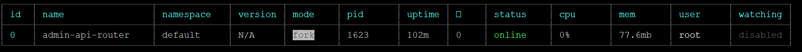
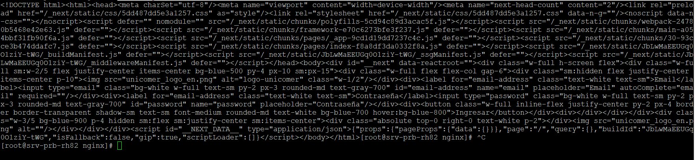

# Configuracion Server Linux

## Programas previos
- NodeJS 16
- NPM
- Nginx
- Git

## Instalar [yarn](https://classic.yarnpkg.com/lang/en/docs/install/#windows-stable)

```bash
npm install --global yarn
```

Comprobar la instalación de yarn
```bash
yarn --version
```

## Descargar el proyecto del **admin-api-router**
- Crear carpeta en el servidor donde vivirá el aplicativo
- Clonar el proyecto desde github o gitlab https://github.com/yhau1989/api-router-admin.git
```bash 
git clone  https://github.com/yhau1989/api-router-admin.git
```
- Acceder a la carpeta del sítio del proyecto 
```bash 
cd /api-router-admin/site
```

- Instalar las dependencias

```bash 
yarn install
```


## Instalar y configurar [PM2](https://pm2.keymetrics.io/)

- Instalación
```bash
npm install pm2 -g
```

- Compilar aplicativo
```bash
yarn build
```

- Levantar aplicativo por medio de pm2
```bash
pm2 start npm --name "admin-api-router" -- start
```


- Comprobar  si el aplicativo esta corriendo en el puerto 3000

```bash
pm2 ls
```


- realizar un prueba con curl
```bash
curl http://127.0.0.1:3000
```


## Configurar Nginx

- Acceder a la ruta /etc/nginx
```bash
cd /etc/nginx
```
- Editar el archivo de configuración **nginx.conf**:

```bash
nano nginx.conf
```

Contenido del archivo, (considerar la ip del servidor en el atributo **server_name**)

```bash
# For more information on configuration, see:
#   * Official English Documentation: http://nginx.org/en/docs/
#   * Official Russian Documentation: http://nginx.org/ru/docs/

user nginx;
worker_processes auto;
error_log /var/log/nginx/error.log;
pid /run/nginx.pid;

# Load dynamic modules. See /usr/share/doc/nginx/README.dynamic.
include /usr/share/nginx/modules/*.conf;

events {
    worker_connections 1024;
}

http {
    log_format  main  '$remote_addr - $remote_user [$time_local] "$request" '
                      '$status $body_bytes_sent "$http_referer" '
                      '"$http_user_agent" "$http_x_forwarded_for"';

    access_log  /var/log/nginx/access.log  main;

    sendfile            on;
    tcp_nopush          on;
    tcp_nodelay         on;
    keepalive_timeout   65;
    types_hash_max_size 2048;

    include             /etc/nginx/mime.types;
    default_type        application/octet-stream;

    # Load modular configuration files from the /etc/nginx/conf.d directory.
    # See http://nginx.org/en/docs/ngx_core_module.html#include
    # for more information.
    include /etc/nginx/conf.d/*.conf;

     server {
        #listen       80 default_server;
        #listen       [::]:80 default_server;
        listen 80;
        server_name  10.131.100.106;
        #root         /usr/share/nginx/html;

        # Load configuration files for the default server block.
        #include /etc/nginx/default.d/*.conf;

        location / {
         # reverse proxy for next server
          proxy_set_header X-Forwarded-For $proxy_add_x_forwarded_for;
          proxy_set_header X-Real-IP $remote_addr;
          proxy_set_header Host $http_host;
          proxy_http_version 1.1;
          proxy_set_header Upgrade $http_upgrade;
          proxy_set_header Connection "upgrade";


          proxy_pass http://127.0.0.1:3000;
          proxy_redirect off;
          proxy_read_timeout 240s;
        }

        error_page 404 /404.html;
            location = /40x.html {
        }

        error_page 500 502 503 504 /50x.html;
            location = /50x.html {
        }
    }

# Settings for a TLS enabled server.
#
#    server {
#        listen       443 ssl http2 default_server;
#        listen       [::]:443 ssl http2 default_server;
#        server_name  _;
#        root         /usr/share/nginx/html;
#
#        ssl_certificate "/etc/pki/nginx/server.crt";
#        ssl_certificate_key "/etc/pki/nginx/private/server.key";
#        ssl_session_cache shared:SSL:1m;
#        ssl_session_timeout  10m;
#        ssl_ciphers PROFILE=SYSTEM;
#        ssl_prefer_server_ciphers on;
#
#        # Load configuration files for the default server block.
#        include /etc/nginx/default.d/*.conf;
#
#        location / {
#        }
#
#        error_page 404 /404.html;
#            location = /40x.html {
#        }
#
#        error_page 500 502 503 504 /50x.html;
#            location = /50x.html {
#        }
#    }

}

```

- Habilitar el reenvio de trafico desde Nginx
```bash
setsebool -P httpd_can_network_connect 1
```

- Reiniciar Nginx y ver su estado
```bash
systemctl restart nginx
systemctl status nginx
```

## Configurar Firewall

- Configurar puertos
```bash
 firewall-cmd --permanent --add-port={80/tcp,443/tcp}
```

- Reiniciar el firerwall
```bash
 firewall-cmd --reload
```

- Comprobar los puetos del firewall
```bash
 firewall-cmd --list-ports
```

## Comprobar el aplicativo desde otro equipo
- Abrir la ruta de la ip del server: http://10.131.100.106/ en el navegador.

## Referencias

- https://gist.github.com/jjsquady/5399d6e1b23f501083a9c262d806e248
- https://curl.se/docs/manual.html
- https://pm2.keymetrics.io/docs/tutorials/pm2-nginx-production-setup
- https://linuxconfig.org/how-to-stop-start-and-disable-enable-firewall-on-redhat-7-linux-system
- https://access.redhat.com/documentation/es-es/red_hat_enterprise_linux/8/html/deploying_different_types_of_servers/configuring-nginx-as-a-web-server-that-provides-different-content-for-different-domains_setting-up-and-configuring-nginx
- https://access.redhat.com/documentation/es-es/red_hat_enterprise_linux/8/html/deploying_different_types_of_servers/configuring-nginx-as-a-reverse-proxy-for-the-http-traffic_setting-up-and-configuring-nginx


